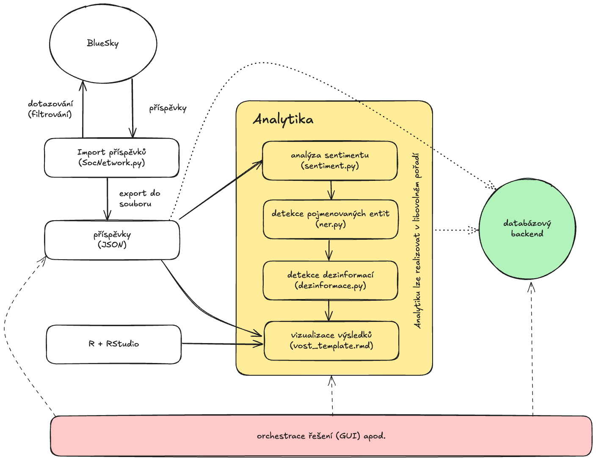
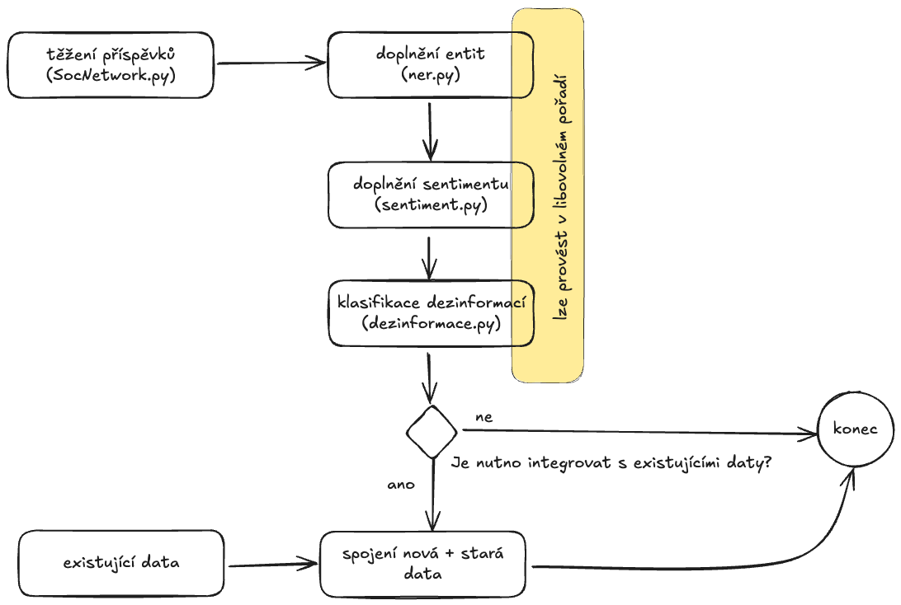
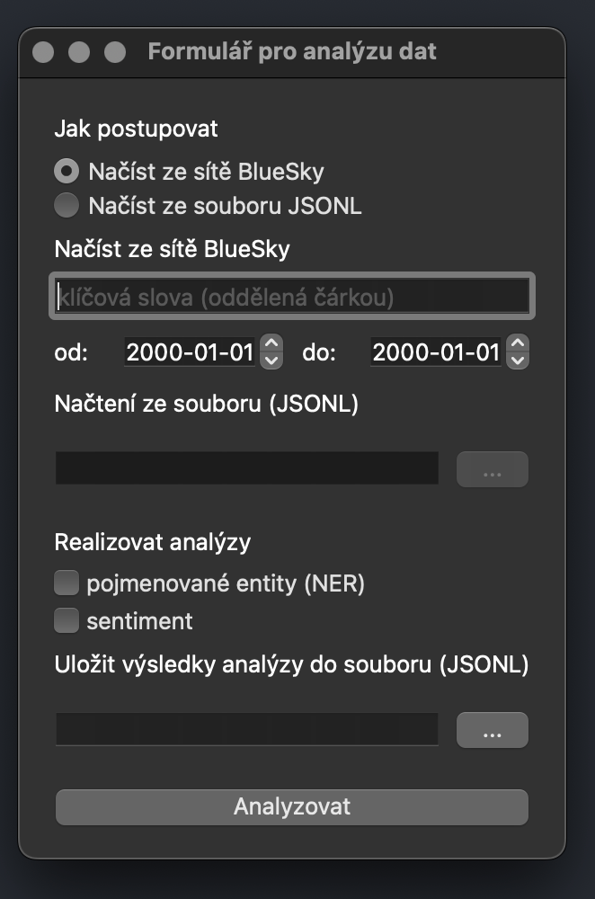

# Využití informací ze sociálních sítí pro podporu krizového řízení

## Softwarová část diplomové práce

Původní verze projektu vznikla pro účely diplomové práce Využití informací ze sociálních sítí pro podporu krizového řízení. Tento repozitář pak představuje aplikaci navrhovaných postup pro praktické řešení tohoto problému.

Implementace v diplomové práci posloužila jako první prototyp pro ověření životaschopnosti navrhovaného řešení. V tomto repozitář je dostupný kód pro druhý prototyp, který na dosažených výsledcích staví, ale zároveň přistupuje k řešení problému odlišným způsobem.

původní diplomovou práci je možno nalézt: https://dspace.vsb.cz/handle/10084/156606

Zatímco první prototyp byl navržen v podstatě jako monolitická aplikace, kde jeden skript dělá vše. Cílem druhého prototypu je převést kód do podoby menších úzce zaměřených modulů, které lze snadno rozšiřovat a přizpůsobit. Druhý prototyp je tedy navržen jako modulární architektura, kde každý modul je samostatný skript, který může být použit jako samostatná aplikace.

Tato architektura kromě zjednodušení údržby a čitelnosti kódu umožňuje doplňovat další moduly, které mohou řešit stejný problém, ale s použitím jiných nástrojů nebo technologií. Příkladem takového nasazení by mohlo být třeba přidání modulu pro hodnocení dezinformací založených na velkých jazykových modelech, jako alternativy k využití jednodušších modelů strojového učení použitých v původní implementaci.

## Popis projektu

Původní projekt se skládal ze dvou hlavních komponent:

1. **Analytický modul (BlueSky.py)** - zajišťuje sběr, zpracování a analýzu dat ze sociální sítě BlueSky s využitím metod strojového učení
2. **Vizualizační dashboard (Dashboard.py)** - interaktivní webové rozhraní pro vizualizaci a interpretaci získaných dat

(oba původní moduly jsou stále dostupné v repozitáři v nezměněné podobě, ... alespoň dočasně)

Nový prototyp je založen na následujících modulech:

1. **načítání příspěvků ze sociálních sítí (SocNetwork.py)** - zajišťuje sběr údajů ze sociálních sítí (v současnosti pouze BlueSky) a zpracování dat.
2. **skórování sentimentu (sentiment-cli.py)** - odhad sentimentu příspěvků na základě metod strojového učení
3. **detekce pojmenovaných entit (ner-cli.py)** - detekce pojmenovaných entit v textu příspěvků
4. **detekce potenciálních dezinformací (dezinformace.py)** - detekce potenciálních dezinformací příspěvků na základě metod strojového učení
5. **(plán) import dat do DB (DBPush.py)** - importuje data z sociálních sítí do databáze
6. **dashboard** - v současnosti realizováno pomocí RMarkdown (předtím, než se ustálí funkcionalita, která by měla být obsažena v této části)

V budoucnu je pak plánováno přidání další vrstvy aplikace, která by měla umožnit jednodušší orchestraci ovládání jednotlivých modulů pomocí uživatelsky přívětivého rozhraní.

Základní představu o architektuře je možno si udělat z obr. níže.



## Požadavky pro instalaci

### Technické požadavky:

- Python 3.13 nebo novější s pip a knihovnami (seznam v requirements.txt)
- MySQL/MariaDB databázový server <- databázová funkcionalita v současnosti není implementována)
- R a RStuido pro funkcionalitu vizualizace výsledků
- Připojení k internetu pro komunikaci s API sociální sítě BlueSky a také stahování předtrénovaných AI modelů

### Potřebné knihovny

Dle používaného prostředí, lze knihovny instalovat buďto globálně. V obecné rovině se to ale z hlediska schopnosti provozovat různé Python aplikace s odlišnými závislostmi nedoporučuje.

```bash
pip install -r requirements.txt
```

nebo vytvořit virtuální prostředí pouze pro tuto aplikaci. Vytvoření virtuálního prostředí je doporučovaným postupem. Veškeré závislosti projektu se v tomto případě konsoludují na jedno místo a to konkrétně složku .env v rootu projektu a to včetně verze Python, Pip i jednotlivých knihovat.

Prostředí je potřeba nainstalovat a aktivovat před použitím aplikace.

```bash
python3 -m venv ../.env # nastavit nové prostředí .env v rootu projektu
source ../.env/bin/activate # aktivovat toto prostředí
python3 -m pip install -r requirements.txt # instalovat závislosti shromážděné v souboru requirements.txt
```

Soubor requirements.txt je dostupný ve složce /bin.

*Upozornění:* v jednu chvíli na počítači může být aktivní pouze jedno virtuální prostředí. V případě, že by na daném stroji byl vyžadován souběžný běh takových prostředí, nelze tento způsob použít. K řešení by bylo potřeba použít jiný způsob, např. kontejnerizace prostředí pomocí technologie Docker.

## Konfigurace a nastavení

se soustřeďuje v souboru config.ini v následující struktuře:

```ini
[database]
host = localhost
port = 8889
user = root
password = root
dbname = vost_data

[casove_limity]
historie_dni = 1
zpozdeni_mezi_dotazy = 1

[BlueSky]
prah_jistoty = 0.75
user = ***
password = ***
```

Sekce database nastavuje konektivitu k databázovému backendu. V současnosti je podporovaná databáze MySQL nebo MariaDB jako altorenativní databáze.

Sekce casove_limity pak specifikuje intenzitu dotazování programu vůči sociální síti. Nastavení historie_dni ovlivňuje kolik dní zpět se bude program dívat. Hodnota 1 je vhodná pro pouze testování, aby se omezil síťový mezi klientem a sociální sítí. Nastavení zpozdeni_mezi_dotazy pak nastavuje kolik sekund má klient počkat, než se znovu dotáže sociální sítě.

Tato nastavení jsou důležitá pro praktické vytěžování sociální sítě, kdy lze očekávat, že sociální sít nebude možné vytěžit v jednom kroku.Klient bude tedy opakovaně oslovovat sociální síť a potřebné informace stáhne postupně. Prodloužení intervalu mezi dotazy by mělo zajistit, že sociální síť nebude přetěžovaná (což by mohlo vést k tomu, že práce klienta bude vyhodnocena např. jako útok.).

**Upozornění**: V současnosti je celé řešení ve fázi ranného prototypu, který je laděn na MySQL. Kompatibilita s MariaDB je proto předpokládaná, nikoliv testovaná.

Samotné nastavení struktury databáze je v souboru sql/setup_db.sql. Tento vytvoří databázi vost_data, pokud ještě neexistuje, a následně vytvoří v ní tabulky pro ukládání dat z sociální sítě BlueSky.

Pro aplikaci SQL příkazů použijte buďto konzoli MySQL nebo příkazovou řádku psql. Alternativně lze použít nástroj jako je MySQL Workbench, nebo phpMyAdmin, podle toho, jak je nastaveno Vaše prostředí.

Sekce BlueSky obsahuje uživatelské jméno a heslo pro přístup k sociální síti BlueSky. Uživatelské jméno a heslo je nutné spojit s existujícím účtem, prostřednictvím kterého je možné přistupovat k sociální síti. *** slouží jako zástupný znak a pro reálnou autentizaci je potřeba použít skutečné uživatelské jméno a heslo.

Parametr prah_jistoty definuje prahovou hodnotu pro vyhodnocení dezinformace. Jesná se o měřítko, nakolik si je model strojového učení jistý, že příspěvek je dezinformací. Výchozí hodnota je 0.75, což znamená, že model strojového učení musí být na 75% jistý, že je příspěvek dezinformací, aby ji takto zaklasifikoval.

Šablona pro soubor config.ini je nalezena v adresáři /template. Zkopírujte ji do kořenového adresáře projektu a upravte ho na účely vašeho projektu.

## Těžení příspěvků pomocí SocNetwork.py

### Použití

```bash
python SocNetwork.py [-h] -p <souborJSONL> -k <souborCSV> [-l <lang>] [-od <datum>] [-do <datum>]
```

Parametry:

- -h, --help  - zobrazí nápovědu a skončí
- -p, --postJSON souborJSONL - soubor JSON s příspěvky
- -k, --keywords souborCSV - soubor CSV s klíčovými slovy (hashtagy)
- -l, --lang lang - jazyk oddělené čárkou, které se má vyhledávat (en, cs, sk), cs je výchozí
- -od, --since datum - datum, od kterého se mají vytěžovat příspěvky v ISO formátu (YYYY-MM-DD)
- -do, --until datum - datum, do kterého se mají vytěžovat příspěvky (včetně) v ISO formátu (YYYY-MM-DD), implicitně je použito aktuální datum

Parametry -od a -do jsou volitelné a jsou použity pro filtrování příspěvků ze sociální sítě BlueSky. Pokud jsou zadány, budou vytěženy pouze příspěvky od daného data až do daného data. Pokud nejsou zadány, budou vytěženy pouze příspěvky od aktuálního data - počtu dní odpovídajícího nastavení v sekci casove\_limity, až do aktuálního data (včetně).

Ve složce template je několik souborů keywords*.csv. Uvedeny soubor obsahuje hlavičku keywords a na každém řádku je samostatně hashtag. Hashtagy zadáváme včetně symbolu #. Příklad souboru s klíčovými slovy pro požáry v Kalifornii:

```csv
klíčová slova
#CaliforniaFires
#CAFire
#WildFire
#CaliforniaWildfire
#FireSeason
#FireWatch
#CaliforniaFireSeason
```

V uvedeném příkladu jsou vyhledávány pouze hashtagy v textu článku. Klíčová slova mohou být jakákoliv. Dotazování pro síť BlueSky podporuje filtrovací syntaxi [Lucene](https://lucene.apache.org/core/2_9_4/queryparsersyntax.html).

Parametr -l je nepovinný pro výběr příspěvků v určitém konkrétním jazyce. Pokud není zadán, výsledky budou v češtině (ekvivalent -l "cs"). Pokud chcete vyhledat příspěvky ve více jazycích, zadávejte všechny jazyky oddělené čárkou a ohraničené uvozovkami, např. "en, cs, sk".

Příklady použití:

```bash
python SocNetwork.py -p data/post.jsonl -k data/keywords.csv
```
Provede vyhledání příspěvků v češtině od včerejška do dneška (historie_dni = 1). Výsledky uloží do souboru data/post.jsonl. Vyhledá klíčová slova načtená ze souboru data/keywords.csv.

Následující příklad vyhledá příspěvky v češtině za měsíc kveten 2025:

```bash
python SocNetwork.py -p data/post.jsonl -k data/keywords.csv -od 2025-04-30 -do 2025-05-31
```

Stejný dotaz ale s příspěvky v angličtině a češtině:

```bash
python SocNetwork.py -p data/post.jsonl -k data/keywords.csv -l "en, cs" -od 2025-04-30 -do 2025-05-31
```

*Upozornění pro soubor s příspěvky* (JSON). Tento soubor pokud neexistuje bude vytvořen, pokud existuje, bude přepsán.

### Struktura příspěvku sítě BlueSky

Skript produkuje výstup ve formátu JSONL (JavaScript Object Notation Line), což je textový výstup, ve kterém bude každý příspěvek zakódován do jediného JSON objekt. Tento objekt bude uložen na jednom řádku (L v JSONL).

Každý příspěvek je v následujícím formátu:

```json
{'author':
  {'did': 'did:plc:ubihjvuzrxf34hotgr45vdbo',
   'handle': 'qtrloop61.bsky.social',
   'associated':
     {'chat':
       {'allow_incoming': 'none',
        'py_type': 'app.bsky.actor.defs#profileAssociatedChat'},
      'feedgens': None, 'labeler': None, 'lists': None, 'starter_packs': None,
      'py_type': 'app.bsky.actor.defs#profileAssociated'},
    'avatar': 'https://cdn.bsky.app/img/avatar/plain/did:plc:ubihjvuzrxf34hotgr45vdbo/bafkreib4pw7a5nod3sjyh2dbl7pwu4xoz5jatlyctijbfohalu7ughbxvu@jpeg',
    'created_at': '2025-06-06T11:01:06.941Z',
    'display_name': 'snoɯʎuouɐ',
    'labels': [],
    'verification': None,
    'viewer':
      {'blocked_by': False, 'blocking': None, 'blocking_by_list': None, 'followed_by': None,
       'following': None, 'known_followers': None, 'muted': False, 'muted_by_list': None,
       'py_type': 'app.bsky.actor.defs#viewerState'},
    'py_type': 'app.bsky.actor.defs#profileViewBasic'},
 'cid': 'bafyreiajcokxuxiekbzon2qq3icog3b3lfdjndoxomn46nsgn7mvrc2li4',
 'indexed_at': '2025-06-24T08:57:10.140Z',
 'record':
   {'created_at': '2025-06-24T08:57:10.822Z',
   'text': '🚨 BREAKING 🚨 \nThe Iranian Military denies any missiles were launched toward Israel after the ceasefire took effect, Iranian state media said on Tuesday, denying violating the ceasefire.\n\n#Netanyahu #Playbook',
    'embed': None, 'entities': None,
    'facets':
      [{'features':
        [{'tag': 'Netanyahu', 'py_type': 'app.bsky.richtext.facet#tag'}],
        'index':
         {'byte_end': 203, 'byte_start': 193,
          'py_type': 'app.bsky.richtext.facet#byteSlice'},
        'py_type': 'app.bsky.richtext.facet'},
       {'features':
        [{'tag': 'Playbook', 'py_type': 'app.bsky.richtext.facet#tag'}],
          'index': {'byte_end': 213, 'byte_start': 204, 'py_type': 'app.bsky.richtext.facet#byteSlice'},
          'py_type': 'app.bsky.richtext.facet'}],
        'labels': None, 'langs': ['en'], 'reply': None, 'tags': None, 'py_type': 'app.bsky.feed.post'},
    'uri': 'at://did:plc:ubihjvuzrxf34hotgr45vdbo/app.bsky.feed.post/3lsdq3spw5k27',
	'embed': None, 'labels': [], 'like_count': 0, 'quote_count': 0, 'reply_count': 0, 'repost_count': 0,
	'threadgate': None,
	'viewer':
	  {'embedding_disabled': False, 'like': None, 'pinned': None, 'reply_disabled': None, 'repost': None,
	   'thread_muted': False, 'py_type': 'app.bsky.feed.defs#viewerState'},
   'py_type': 'app.bsky.feed.defs#postView'}
 }
```

Výše uvedený příklad je náhodně načtený příspěvek na základě vyhledávání \#Netanyahu v době počátku válečného konfliktu mezi Izraelem a Iránem.

Jak je z výše uvedeného patrné, je poskytovaná informace komplexní. Její nejdůležitější části jsou:
- author - informace o autoru příspěvku
	- did - DID je perzistentní, dlouhodobý, unikátní identifikátor autora
	- handle - člověkem čitelný identifikátor účtu
	- display_name - jméno, pod jakým je viditelný pro ostatní uživatele sítě
- record - příspěvek samotný
	- created_at - časová značka (datum a čas) vzniku příspěvku
	- text - text příspěvku včetně formátovacích znaků (např. \n - znak nového řádku)
	- facets - pole obsahující jednotlivé zájmové objekty v rámci textu příspěvku
	- lang - dvoupísmenný identifikátor jazyka příspěvku
	- uri - identifikuje příspěvek formou odkazu na něj v distribuovaném repozitáři
- cid - content identifier - kryptograficky generovaný hash obsahu příspěvku, s vysokou pravděpodobností unikátní

Zajímavou částí souboru jsou facets v record části souboru (příspěvku). Facets mohou být např. hashtagy (tagy v terminologii sítě BlueSky), ale třeba také linky. Tyto části jsou enginem sítě BlueSky osamostatněny - každý pak tvoří jeden feature záznamu. V našem případě jsou v textu příspěvku přítomny pouze dva tagy \#Netanyahu a \#Playbook, což vede na dva features.

Typ feature je patrný z 'py_type': 'app.bsky.richtext.facet#tag'. Tagy mají na konci \#tag a linky \#link.

Jednotlivé typy objektů je možné také identifikovat přímo z textu příspěvku, např. s použitím regulárních výrazů. Z pohledu efektivity zpracování se ale může jednat o postup výpočetně dražší, než použití předpřipravených facets.

Podrobnější dokumentace https://docs.bsky.app/docs/advanced-guides/posts.
## Analýza sentimentu pomocí sentiment-cli.py

Tento skript provede analýzu příspěvků ze sítě BlueSky uložených ve formátu JSONL. Soubor ve správném formátu je možno získat pomocí skriptu SocNetwork.py

použití:

```bash
python sentiment-cli.py -p <souborJSONL> -s <souborJSONL>
```

Parametry:
- -h, --help  - zobrazí nápovědu a skončí
- -p, --postJSON souborJSONL - soubor JSON s příspěvky
- -s, --sentiment souborJSONL - soubor JSON s určením sentimentu příspěvků

příklad použití:

```bash
python sentiment-cli.py -p data/post.jsonl -s data/sentiment.jsonl
```

Spočítá sentiment příspěvků uloženým v souboru data/post.jsonl a výsledek uloží do souboru data/sentiment.jsonl.

Technicky skript přidá informaci o sentimentu k existujícím záznamům předaných parametrem -p a doplní k nim sekci "sentiment" s hodnotou sentimentu v následujícím formátu:

```json
{
  ... zbytek příspěvku
	"sentiment": {
		"label": "1 star",
		"score": 0.99,
		"sentiment": "negativní"
	}
}
```

- "label" obsahuje predikované hodnocení podle použitého modelu strojového učení. Různé modely poskytují různé výsledky
- "score" je hodnota konfidence modelu strojového učení v intervalu [0, 1]
- "sentiment" je slovní vyjádření sentimentu v češtině (negativní, neutrální, pozitivní)

Např. model BERT base v label používá hvězdičkovou notaci (1 - 5 hvězdiček), ale model Czert-B vrací přímo slovní hodnocení (negativní, neutrální, pozitivní), tedy pro tento model je label vlastně stejný jako sentiment, ovšem s tím, že u sentimentu je vynuceno použití malých písmen.

V současnosti jsou používány následující modely:
- pro jazyky: en, nl, de, fr, it, es se používá https://huggingface.co/nlptown/bert-base-multilingual-uncased-sentiment.
- pro češtinu (cs) se používá: https://huggingface.co/UWB-AIR/Czert-B-base-cased
- ostatní jazyky v současnosti nejsou podporovány, ale principiálně je není problém v případě zájmu doplnit

**Model BERT base**

Model podporuje řadu jazyků, ale čeština nebo slovenština mezi nimi nejsou. Základní informace o podporovaných jazycích a přesnosti modelu je dostupná v následující tabulce.

| jazyk   | přesnost (exact) | přesnost (off-by-1) | lang |
| ------- | ---------------- | ------------------- | ---- |
| English | 67%              | 95%                 | en   |
| Dutch   | 57%              | 93%                 | nl   |
| German  | 61%              | 94%                 | de   |
| French  | 59%              | 94%                 | fr   |
| Italian | 59%              | 95%                 | it   |
| Spanish | 58%              | 95%                 | es   |

Přesnost znamená, jak model přesně trefil hodnocení hvězdiček provedené člověkem. Off-by-1 je pak představuje procentu ve kterém model byl zcela přesný nebo se spletl o 1 hvězdičku. Hodnocení modelem tedy z tohoto pohledu bylo podobné.

**Model Czert-B**

Je taktéž modelem, který je založen na BERT, ale je trénován jen a pouze na datech v češtině, včetně české verze Wikipedia, a řady dalších zdrojů.

Trénovací množina je velmi robustní, avšak čeština je velmi složitý jazyk a tak je výkonnost z určitého pohledu horší. Autoři uvádějí okolo 80 % (exact přesnost). Vzhledem k odlišnému způsobu práce modelu, není off-by-1 metriku možno změřit.

## Detekce entit (NER)

Vytvoří seznam pojmenovaných entit, které se používají v příspěvku a vloží jej do výstupního souboru.

Princip fungování je podobný jako v případě analýzy sentimentu. Jako vstup používáme soubor typu JSONL jako vytváří SocNetwork.py. Pracuje ale také s výstupy ze sentiment.py, jelikož jsou obsahově kompatibilní. Je tedy možné na příspěvcích s doplněným sentimentem realizovat detekci entit a na příspěvcích s detekovanými entitami realizovat detekci sentimentu.

Skripty ner-cli.py a sentiment.py tedy pouze doplňují informace k příspěvkům.

Použití:

```bash
python ner-cli.py -p data/post.jsonl -n data/ner.jsonl
```

Parametry:
- -h, --help  - zobrazí nápovědu a skončí
- -p, --postJSON souborJSONL - soubor JSON s příspěvky
- -n, --ner souborJSONL - soubor JSON s detekovanými entitami u příspěvků

Spočítá sentiment příspěvků uloženým v souboru data/post.jsonl a výsledek uloží do souboru data/sentiment.jsonl.

Identifikované entity vypadají např. takto: Tehran (LOC), Tel Aviv (LOC), Trump (PER), Netanyahu (PER), Yousuf Nazar (PER). Formát je vždy entita a typ entity, např. Tel Aviv (LOC) - tedy lokace, Trump (PER) - tedy persona/osobnost.

Identifikace je do jisté míry závislá na jazyku. Např. Tehran je označení hlavní města Iránu v angličtině, v češtině by byl ale použit název Teherán. O kvalitě detekce tak rozhoduje model, který byl použit pro detekci entit.

Pro detekci entit se v současnosti používají dva modely:
- dbmdz/bert-large-cased-finetuned-conll03-english, který je adaptován na texty v angličtině.
- SlavicNLP/slavicner-ner-cross-topic-large pro jazyky čeština, polština, bulharština, ruština a ukrajinština

Entity mohou být následujícího typu:
- LOC - lokace
- PER - persona (osobnost)
- ORG - organizace
- EVT - events (událost)
- PRO - produkt
- MISC - různé

Technicky skript přidá informaci o detekovaných entitách k existujícím záznamům předaných parametrem -p a doplní k nim sekci "ner" s hodnotou sentimentu v následujícím formátu:

```json
{
  ... zbytek příspěvku
	"ner": [{
		"slovo": "detekovaná entita",
		"entita": "typ entity (např. PER)"},
		{...detekováno může být více entit}
	]
}
```

## Detekce potenciálních dezinformací

### Použití

Tento skript provádí analýzu příspěvků na dezinformace. Skript předpokládá vstup ve formátu produkovaném SocNetwork.py s nebo bez sentimentu a NER.

Podobně jako u hodnocení sentimentu a NER tento skript přidává informace do datového souboru, konkrétně je příspěvek zaklasifikován buďto jako "fake news" nebo naopak "reliable news".

```json
{
  ... zbytek příspěvku
	"dezinformace": {
		"label": "fake news nebo reliable news",
		"score": "konfidence modelu"
	}
}
```

Použití:

```bash
python dezinformace.py -p <souborJSONL> -d <souborJSONL>
```

Parametry:
- -h, --help  - zobrazí nápovědu a skončí
- -p, --postJSON souborJSONL - soubor JSON s příspěvky
- -d, --desinformaceJSON souborJSONL - soubor JSON s pojmenovanými identifikace (fake news/reliable news)

Základem v tomto případě je model https://huggingface.co/facebook/bart-large-mnli, který je určen pro zpracování textu v anglickém jazyce. V současnosti skript nedetekuje jazyk a nemá tak oficiální podporu pro zpracování takových textů (jelikož ale jazyk nekontroluje, takže model ve finále příspěvek zatřídí, ale lze předpokládat, že to nebude správně.)

*Pozn.:* tento modul je realizován v rozsahu v jakém byla realizována původní implementace pana Mutiny. (Byl tedy pouze přidáno rozhraní pro ovládání z příkazové řádky, načítání konfigurace z externího souboru a výstup jde do JSON místo CSV.)

### Omezení

Oproti ostatním skriptům v tomto balíku, je detekce dezinformací problematická z několika důvodů. Jednak nemá implementovanou podporu češtiny, jednak je sporné, zda realizovaná detekce, resp způsob, jakým je realizována má potenciál zachytit dezinformace.

Skript využívá tzv. "zero shot" klasifikaci, čímž se rozumí, že modelu realizujícímu klasifikaci se předkládá text, který má být klasifikován a popisky/kategorie (label), které se mají textu přiřadit. V našem případě se jedná o dvojici fake news, reliable news a to je problém.

Tento způsob je dobře použitelný také pro jiné účely, např. detekci spamu (popisky např. ham/spam) nebo analýzu sentimentu (popisky např. negativní/neutrální/pozitivní), apod.

Sentiment, spam apod. mají ale proti dezinformacím poměrně velkou výhodu, jedná se totiž o dobře popsané problémy, pro které jsou dostupné rozsáhlé datové sady, na kterých se neuronové sítě jednotlivých modelů adaptují. Jejich potenciál pro plnění takových úloh je proto tedy vysoký.

Případ dezinformací (alternativních informací, fake news, apod.) je komplikovanější. Tyto informace jsou explicitně připravovány tak, aby byly obtížně rozlišitelné od správných informací i člověkem, natož umělou inteligencí. To samo o sobě znesnadňuje detekci. Dalším problémem je, že dezinformační scéna se dynamicky mění v čase tak, jak se mění na jedné straně politické cíle těch, kteří dezinformační kampaně realizují a také pružně reagují na různé aktuální události a témata, která rezonují společností.

Adaptace neuronových sítí je realizována vždy na základě předpřipaveného korpusu textu. Tento korpus představuje určitý snímek v čase, ke kterému byl pořízen. V případě předtrénovaných modelů, které jsou využívány napříč moduly tohoto balíku je obvykle tento "snímek" starý několik let a nemůže proto obsahovat výše uvedené změny ve společnosti a trendy dezinformační scény, to dále zhoršuje prediktivní schopnosti použitých modulů.

Abychom to shrnuli - schopnosti detektoru dezinformací jsou velmi omezené a nelze na ně spoléhat. Zároveň však lze říci, že se jedná o velmi zajímavé téma pro další výzkum, např. směrem k použití velkých jazykových modelů např. pro identifikaci různých trendů nebo změn v trendech, které mohou pomoci s identifikací dezinformací.

## Strategie použití

Z hlediska nasazení vždy začínáme těžením příspěvků pomocí SocNetwor.py. Výsledek se uloží do souboru JSONL, se kterým lze dále pracovat, jednak ve smyslu doplňování dalších informací:
- ner-cli.py - detekce pojmenovaných entit
- sentiment.py - detekce sentimentu
- dezinformace.py - detekce fake news (s velkou řadou omezení)

jednak ve smyslu další práce s takto shromážděnými informacemi. JSONL je formát, který je dobře znám a je velmi dobře strojově zpracovatelný pomocí nástrojů jako je R, PowerBI, různé nástroje statistické analýzy, nebo další Python skripty.

JSONL také umožňuje jednoduchou integraci takových souborů. V tomto typu souborů představuje každý řádek jeden příspěvek (včetně případně doplněných metainformací NER, sentiment, apod.). Můžeme proto integrovat jednoduše výsledky postupného dotazování sociální sítě realizovaného např. po dnech.

Fungovalo by to tak, že každý den zpětně bychom vytvořili pomocí SocNetwork.py JSONL soubor s příspěvky za daný den. Pro tyto příspěvky bychom doplnili metainformace a následně připojili tento soubor k existujícím záznamům.

Tento postup je výhodný z několika pohledů:
- umožňuje udržovat datové sady vytěžených příspěvků, které budeme podrobovat analýze relativně malé
- spojením textových souborů je technicky triviální a poskytne ucelený pohled na analyzovaný problém.

Postup je naznačen na následujícím obrázku:



Doplňování metainformací k příspěvkům lze provádět v libovolném pořadí, jednotlivé skripty pouze doplňují informace.

Možná Vás napadne otázka, proč nezrealizovat tyto analýzy v jednom kroku (skriptu). V současnosti by to technicky šlo, toto řešení by ale bylo extrémně obtížně škálovatelné a to díky potřebě použití celé řady modelů podle úlohy, která má být na příspěvcích realizována a na jazyku, ve kterém je příspěvek napsán.

Nejmenší model použitý v rámci toto balíku má 426 MB, největší pak 2,15 GB, pokud bychom všechny modely, které za jistých okolností balík používá iniciovaly najednou zabraly by v paměti necelých 7 GB. K této potřebě paměti je potřeba připočítat běžnou spotřebu paměti skripty samotnými.

Toto architektonické řešení je pro současnou fázi vývoje systému dostatečné. Pokud by se ale měla přidat podpora většího množství modelů, např. pro účely srovnání výkonnosti pro různé úlohy v různých jazycích není použitý způsob práce s modely úplně efektivní a musel by se změnit. Předělat by bylo nutné především oblast jazyků a modelů, které jsou na ně mapovány.

## Analýza výsledků

Pro analýzu výsledků pan Mutina vytvořil dashboard (dashboard.py) využívající zjednodušený webový server a využívá webový prohlížeč pro práci s dashboardem. V této verzi je ale analytika řešena pomocí RMarkdown zejména z důvodu nejistot okolo informací, které by měly být z dat odvozovány.

RMarkdown má výhodu v tom, že umožňuje kombinovat text, kód (v R), který bude realizovat výpočty, vizualizace výpočtů a zobrazování výsledků, např. tabulek. Je tedy možné velmi jednoduše postupně měnit výpočet tak, aby skutečně vyhovoval potřebám uživatele. R je open source nástroj (jazyk) určený k realizaci datových analýz, realizace změn v analýze je tak  jednodušší tímto způsobem, nežli použití plnohodnotného jazyka jako je např. Python.

To nutně ale neznamená, že vizualizace tímto způsobem je konečným řešením tohoto problému - otevírá ale možnosti k vedení diskuze o vlastnostech, které by výsledek měl splňovat.

RMarkdown řešení tak může být vnímáno jako mezikrok, nebo prototyp pro otestování myšlenek a přístupů k analýze dat, který později může posloužit jako odrazový můstek pro návrh řešení nového.

Pro zprovoznění budete potřebovat:

- R: https://www.r-project.org
- RStudio Desktop: https://posit.co/download/rstudio-desktop/

Po instalaci, otevřete RStudio a v něm vzorový soubor data/vost_template.rmd (nebo ještě lépe jeho kopii :-). Zobrazí se soubor s analýzou v RMarkdown formátu. Tento formát je velmi jednoduchý na pochopení. Existuje celá řada tutoriálů, které Vás provedou základy:

- např. videotutoriál: https://www.youtube.com/watch?v=K418swtFnik
- nebo v textové podobě (velmi stručný v češtine): https://www.wikiskripta.eu/w/R_Markdown
- podrobnější v angličtině: https://ourcodingclub.github.io/tutorials/rmarkdown/ (tento tutoriál je udělaný velmi kvalitně)

Soubor obsahuje sekci:

```{r mastavení}
soubor <- "postIran_dezinfor.json"
```

v rámci které nastavujete zdroj dat, který má být v analýze použit. Mělo by se jednat o JSONL soubor, tak jak jej vytváří těžební skript SocNetwork.py případně doplněný o další metainformace jako jsou pojmenované entity, sentiment a dezinformace.

Šablona je připravena tak, aby vyhodnotila, jaké informace jsou v datovém souboru k dispozici a některé analytické práce a vizualizace jejich výsledků nerealizovala, pokud soubor neobsahuje data pro jejich realizaci.

Skript předpokládá, že analyzovaný soubor bude ve stejné složce jako je soubor RMD. Alternativně můžete zadat úplnou cestu k souboru.

Celou analýzu spustíte kliknutím na tlačítko *knitt* v záhlaví okna v rámci RStuio. RStudio zpracuje postupně všechny kroky analýzy, pospojuje je s textem a vytvoří report ve zvoleném formátu (implicitně HTML). Pro tuto analýzu je výsledek dostupný v souboru data/vost_template.html.

Nebo můžete použít interaktivní režim práce. V rámci něj postupujeme po jednotlivých blocích kódu směrem shora-dolů. Výsledky procesu pak budou viditelné přímo pod blokem kódu. Tento způsob je ideální pro ladění. Realizace změn pak může podle charakteru změny vyžadovat pouze znovu-spuštění určitého bloku kódu, nebo jeho části.

*Upozornění*: vzorová analýza byla realizována na bázi testovacího souboru s jedním dnem, z tohoto důvodu grafy obsahují pouze jeden bod. V případě, že by ale data obsahovala dnů více, měly by výsledné grafy vypadat již normálně. Malý datový soubor byl zvolen pro zjednodušení testování v průběhu vývoje.

## GUI - v experimentální verzi

Ve verzi 0.6 byla do balíku přidáno také základní GUI pro většinu funkcionality dostupné z příkazové řádky - vlastně všechnu s výjimkou vizualizace.

GUI je jednoduché, viz snímek obrazovky níže a umožňuje nastavit, jakým způsobem budou získány příspěvky. První cestou je získání příspěvků ze sociální sítě BlueSky (tedy vytěžením) na základě zadaných klíčových slov a rozsahu dat od - do. Druhou cestou je zadání cesty k JSONL souboru obsahující již dříve vytěžené příspěvky, pro které je potřeba doplnit pojmenované entity a nebo zhodnotit sentiment.

Volba analytických činností je přímočará pomocí zaškrtávacích políček. Výhodou tohoto přístupu je, že v případě zaškrtnutí obou činností se uloží přímo do jediného výstupního souboru JSONL. 

Pro srovnání, při použití rozhraní příkazové řádky se pro každou aktivitu vytvoří výstupní soubor.

Analýza se spustí kliknutím na tlačítko "Analyzuj". 

Spuštění GUI se děje pomocí příkazové řádky:

```python
python3 SfVOST-GUI.py
```
Další interakce s uživatelem probíhá pomocí GUI.



Upozorňuji, že implementace GUI je nutno považovat za experimentální, což znamená jednak, že může obsahovat chyby, jednak že její chování není optimální. Např.  informace o průběhu analýz, nebo toho, že funkce programu skončila s analýzou se nezobrazují v GUI, ale na příkazové řádce.

## Licence k použitým modelům

Před použitím prostudujte licence k jednotlivým modelům. Dle způsobu, jakým hodláte systém nasadit, může být nutné jeden nebo více modelů nahradit jinými, které např. připouštějí Vámi plánovaný způsob nasazení.

| typ          | model                                            | URL                                                                     | licence         |
| ------------ | ------------------------------------------------ | ----------------------------------------------------------------------- | --------------- |
| NER          | SlavicNLP/slavicner-ner-cross-topic-large        | https://huggingface.co/SlavicNLP/slavicner-ner-cross-topic-large        | Apache 2.0      |
| NER          | dbmdz/bert-large-cased-finetuned-conll03-english | https://huggingface.co/dbmdz/bert-large-cased-finetuned-conll03-english | ?               |
| sentiment    | nlptown/bert-base-multilingual-uncased-sentiment | https://huggingface.co/nlptown/bert-base-multilingual-uncased-sentiment | MIT             |
| sentiment    | UWB-AIR/Czert-B-base-cased                       | https://huggingface.co/UWB-AIR/Czert-B-base-cased                       | CC BY-NC-SA 4.0 |
| dezinformace | facebook/bart-large-mnli                         | https://huggingface.co/facebook/bart-large-mnli                         | MIT             |

(Každý z modelů je licencován samostatně.)

## Verze

### v0.6

Tato verze se zcela zaměřuje na doplnění alespoň základního rozhraní pro ovládání analytických činností pomocí GUI.

### v0.5

- drobné úpravy v analýze sentimentu, přidání funkce pro vyčištění textu s cílem zvýšit výkon používaných modelů
- SocNetworks.py
  - odebrány některé neoužívané procedury
  - lepší kontrola data od - do
- refaktorovány skripty s cílem osamostatnit programovou logiku do samostatných tříd pro pozdější implementaci GUI

# Věci k dodělání

- integrující skript který na jeden příkaz zrealizuje vše
- GUI program pro zastřešení celého projektu
- implementace dashboard
- odlišná implementace datových struktur, např. pomocí Parquet (pokud by se uvažovalo o zpracovávání opravdu velkých objemů dat)

... ne nutně ve výše uvedeném pořadí.
